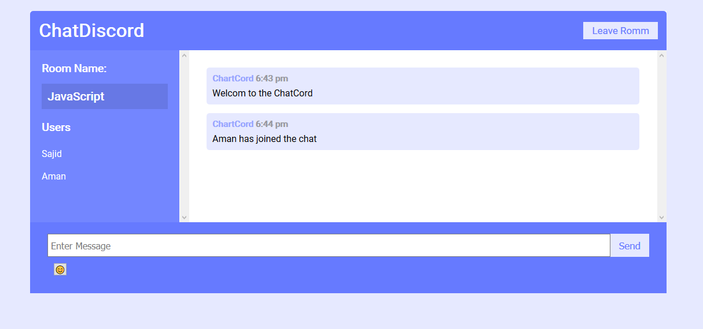
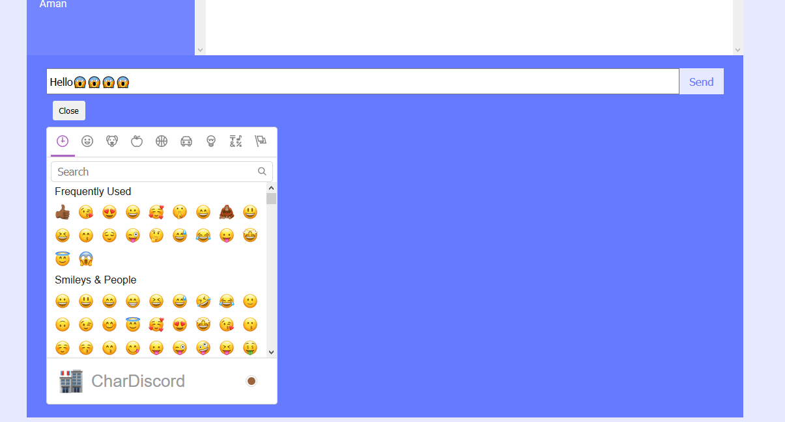
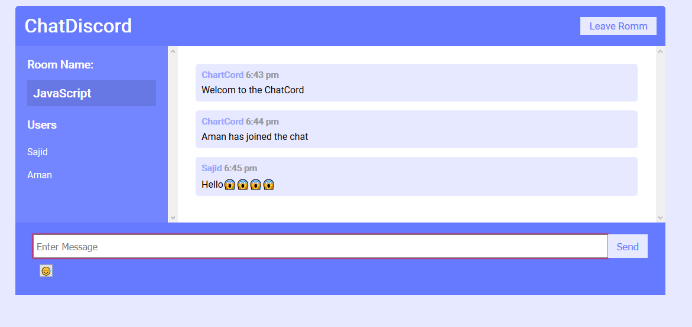
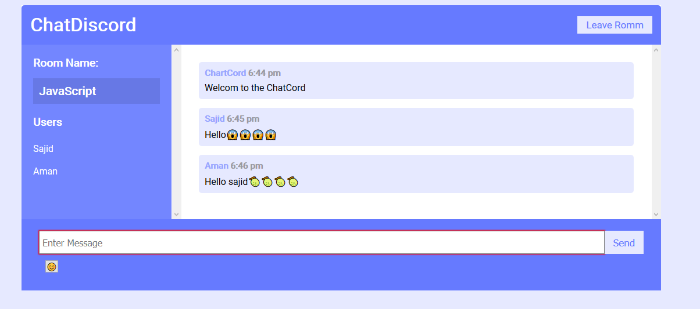

> A real time chat application made with modern technologies, ReactJS, NodeJS, and Socketio.

## App features:

- Join chat based on rooms like Js,Python,Java etc :thumbsup: :heavy_check_mark:
- Send message to group in real time :outbox_tray: :inbox_tray:
- Share Funny Emoji like facebook massenger :smile: :blush: :money_mouth_face:

## Demo

## Be sure give a star and forked :sweat_drops: :v:
